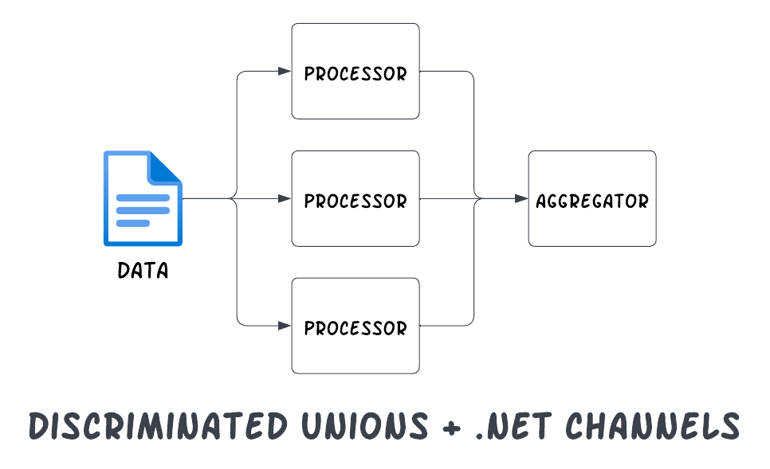

# Discriminated Unions and .NET Channels



## Overview

- .NET channels are an easy way to achieve high throughput, concurrent/parallel processing for information without the need to manage common challenges with thread synchronization
- Discriminated unions pair nicely with .NET channels as a way to process many different types of data simultaneously
- When combined, .NET channels with discriminated unions make it easy to process and combine streams of data.

## .NET and Discriminated Unions.

If you've used TypeScript or F# or any language that natively supports DUs, then you're already familiar with it.

C# currently does not natively support discriminated unions as a language feature, [but it has been on the roadmap now for several months (years?)](https://github.com/dotnet/csharplang/blob/main/meetings/2024/LDM-2024-03-27-presentation.pdf).

Today, it is possible to easily add DU-like patterns to your C# codebase using two .NET libraries:

- [OneOf](https://github.com/mcintyre321/OneOf)
- [dunet](https://github.com/domn1995/dunet)

Both make it easy to adopt DUs in your codebase progressively.

There are a lot of benefits and use cases for DUs, but one of my favorites is using them in conjunction with .NET channels because it is common that there is a need to process a single record with different logic and then combine the results at the end.

Typically, the code to do so might look like this:

```csharp
foreach (var record in records)
{
  await ProcessingAction1Async(record);
  await ProcessingAction2Async(record);
  await ProcessingAction3Async(record);
}
```

This is fine if each step is fast and cannot be parallelized.  But what if each step is costly and actually discrete (no dependency on the previous result)?  Processing all three steps in parallel would make better use of hardware and improve the throughput of the system.

Today, we'll take a look at how to use discriminated unions in C# with .NET channels to achieve exactly that.

## The Use Case

Imagine that we are processing a CSV file that has a list of call logs and the processing pipeline needs to run a series of prompts over the call record in parallel to process:

1. Determine the **urgency** of the call
2. Decide which department the call should be **routed** to
3. The **keywords** associated with the call so we can tag it and find it later

Since these actions are all discrete, we can process these in parallel (e.g. using different LLM prompts) and then simply aggregate the resultant facet of the call log and perform the routing once we have all three facets.

A perfect use case for .NET channels.

## Setting Up the Producer

The exact mechanism of how we source the call records doesn't matter and is outside of the scope of this example.  In fact, we'll simply write a producer that produces a sequence of numbers.  (In the real world, you might read a line of text from a CSV or a database):

```csharp
// Our producer yields a series of async tasks.  Each task processes
// one facet of the call that we want to produce metadata for.
var producerTasks = Enumerable
  .Range(0, 100)
  .AsParallel()
  .WithDegreeOfParallelism(10)
  .SelectMany(i => {
    return new Task[] {
      // TODO: Do work in parallel here
    };
  });
```

For a range of numbers 0 - 100 (imagine these represent the 100 rows of a call center log database), we want to run some tasks in parallel to determine the urgency, routing, and keywords.

## Setting Up the Channel

To support this, we want to create a `System.Threading.Channel` to process the records in parallel and then aggregate the information synchronously in a single aggregator.

The channel is a good abstraction here as it simplifies the synchronization of the parallel processing to a single thread on the read side.

But how do we type our channel?  There are at least three reasonable ways:

1. We could use a base class, but the various parts are mostly discrete aside from sharing the ID of the call record.
2. We could also use a generic class like `Fragment<T>` where `T` is the type of our fragment, but this has some ergonomic issues when it comes to handling the actual action on the aggregation side.
3. Use a discriminated union!

Our channel is created using a tuple type which has the integer representing the ID and the facet of the call log that is produced:

```csharp
var channel = Channel.CreateUnbounded<(int, CallLogFacet)>();
```

Note that the channel is created using the type `CallLogFacet`, but we can write any of the three types in the union to the channel.

## Main Processing Flow

Let's look at how we set up the main processing flow:

```csharp
// 👇 Start our aggregator but do not await
var aggregatorTask = aggregator(channel.Reader);

// 👇 For a series of call records, process three facets in parallel
var producerTasks = Enumerable
  .Range(0, 20)
  .AsParallel()
  .WithDegreeOfParallelism(10)
  .SelectMany(i =>
  {
    return new Task[]
    {
      urgencyProducer(channel.Writer, i),
      routingProducer(channel.Writer, i),
      keywordsProducer(channel.Writer, i)
    };
  });

// 👇 Wait for all of the concurrent/parallel tasks to complete.
Task.WaitAll([.. producerTasks]);

channel.Writer.Complete();

// 👇 Wait for the aggregator to receive all the facets.
await aggregatorTask;
```

Note how we invoke our producers and do not `await` them and instead simply collect the `Task`s (if you're familiar with TypeScript, then `Task` is the equivalent of `Promise`).

## The Producers

In our case, each "producer" will simply create a class instance that represents a fragment of information (in the real world, you might reach out to an LLM to calculate a real urgency score, routing ticket, or keywords):

```csharp
var urgencyProducer = async (
  ChannelWriter<(int, CallLogFacet)> writer, int callRecord
) =>
{
  // TODO: Actual logic here to compute urgency
  await writer.WriteAsync((callRecord, new UrgencyScore()));
};

var routingProducer = async (
  ChannelWriter<(int, CallLogFacet)> writer,
  int callRecord
) =>
{
  // TODO: Actual logic here to determine routing
  await writer.WriteAsync((callRecord, new RoutingTicket()));
};

var keywordsProducer = async (
  ChannelWriter<(int, CallLogFacet)> writer,
  int callRecord
) =>
{
  // TODO: Actual logic here to extract keywords
  await writer.WriteAsync((callRecord, new KeywordTags()));
};
```

## The Reader

And finally, our aggregator which reads messages off of the channel and checks to see if our call log has all of the parts ready.  If so, we'll send it off for routing:

```csharp
// The reader side of the channel which aggregates the facets and then sends
// off the call log for routing.
var aggregator = async (ChannelReader<(
  int RecordId,
  CallLogFacet Facet
)> reader) =>
{
  var state = new Dictionary<int, CallLog>();

  while (await reader.WaitToReadAsync())
  {
    // Read individual messages off of the channel
    if (!reader.TryRead(out var part))
    {
      continue;
    }

    if (!state.ContainsKey(part.RecordId))
    {
      // Initialize the log if we haven't received any facets yet
      state[part.RecordId] = new CallLog();
    }

    var log = state[part.RecordId];

    // 👇 Update the log with the produced facet; note how concise this code is.
    part.Facet.Switch(
      urgency => log.Urgency = urgency,
      routing => log.Routing = routing,
      keywords => log.Keywords = keywords
    );

    if (log.IsReady)
    {
      // The log has all three parts aggregated; route it
      Console.WriteLine($"Call record {part.RecordId} ready; routing...");

      await log.RouteAsync();
    }
  }
};
```

Despite the fact that the channel can produce three totally different facets of the call log, the handling of the facets on the read side is concise and clear because of the DU.

---

## Closing Thoughts

Discriminated unions pair nicely with .NET channels when the workload can be parallelized and each part of the workload produces a discrete result.  The channel eliminates much of the complexity with synchronization when it comes to multi-threaded workloads while the DU improves the ergonomics of working with a channel that can produce multiple types of output.

While C# currently lacks native support for DUs, libraries like dunet and OneOf provide easy-to-adopt
